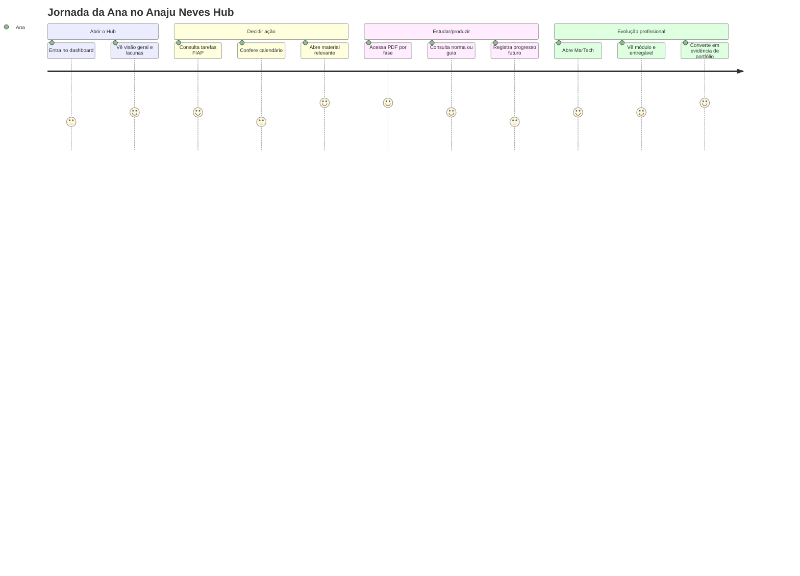
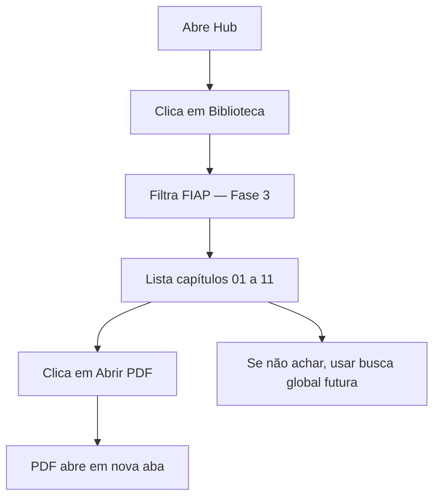
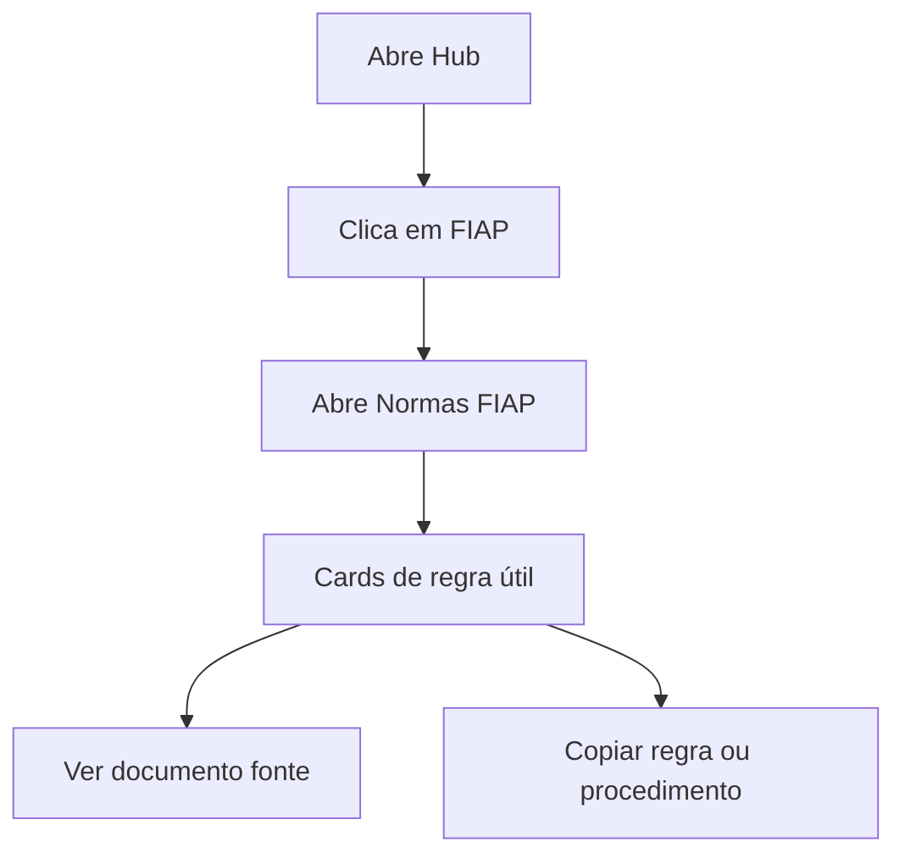
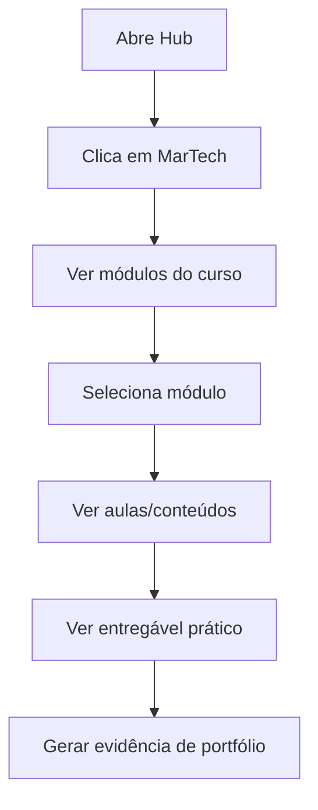
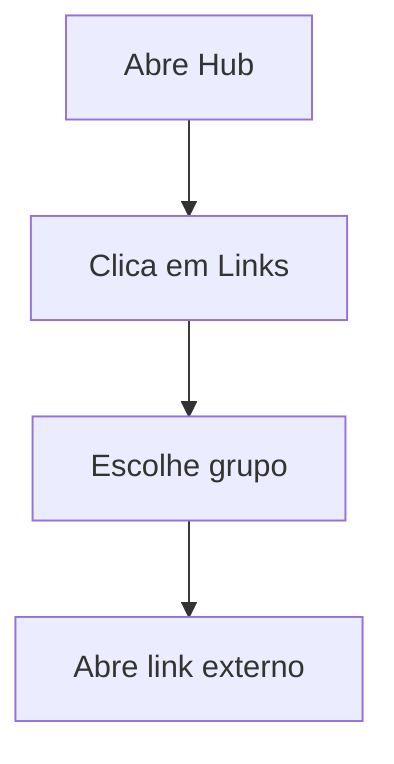

# Anaju Neves Hub — Product Architecture, UX Audit e Plano de Evolução

> Documento vivo para consolidar o repositório `FIAP-HUB`, recuperar coisas deixadas para trás, corrigir a arquitetura de informação e orientar a evolução do dashboard com base nos inputs reais da Ana.

---

## 0. Visão executiva

**Anaju Neves Hub não deve ser um dashboard motivacional, nem um amontoado de cards.** Ele deve funcionar como uma central de controle acadêmica, profissional e documental: FIAP, calendário, normas, guias, biblioteca de fases, MarTech, documentos extras e links usados com frequência. O objetivo principal é reduzir fricção operacional: encontrar rápido o que estudar, o que entregar, onde acessar, qual regra seguir e qual material consultar.

### Critério de sucesso

O hub só deve ser considerado útil quando responder, em poucos segundos:

1. O que tenho que fazer agora?
2. Qual fase/disciplina/material isso pertence?
3. Onde está o PDF, guia, norma, curso ou link?
4. Qual calendário ou prazo está envolvido?
5. O que ainda não foi catalogado?
6. O que é FIAP, o que é MarTech, o que é extra/manual e o que é pessoal?

---

## 1. Diagnóstico do repositório

### 1.1 Estado geral

O repositório está público e tem como branch principal `main`. O tamanho do repositório é relevante para um dashboard acadêmico, pois já há muitos PDFs, imagens e HTMLs. A estrutura atual mistura três gerações do produto:

1. **Central Acadêmica original**: `index.html`.
2. **Dashboard/Hub mais experimental**: `dashboard.html`, `life-os.html`.
3. **Versão atual em consolidação**: `anaju-neves-hub.html`.

### 1.2 Arquivos HTML encontrados e papel recomendado

| Arquivo | Papel atual | Diagnóstico | Decisão recomendada |
|---|---|---|---|
| `index.html` | Central Acadêmica FIAP com calendário, FullCalendar, links rápidos, materiais e tracker Solar+ | Tem funcionalidades importantes que foram deixadas para trás na versão nova, especialmente calendário visual, links rápidos e materiais por track | **Preservar como referência funcional. Não apagar. Extrair recursos para o novo hub.** |
| `dashboard.html` | Dashboard React/Tailwind com estética mais premium, tarefas, cursos e calendário próprio | Ainda usa o nome antigo `J.One Hub` e dados estáticos. Tem componentes úteis de UI e interação | **Preservar como laboratório visual, mas não usar como fonte principal.** |
| `life-os.html` | Primeira tentativa local-first do Life OS | Ficou conceitualmente superado pelo nome e pela navegação nova | **Arquivar depois que `anaju-neves-hub.html` estiver estável.** |
| `anaju-neves-hub.html` | Versão atual da central | Está mais alinhada, mas ainda incompleta em IA, links, normas, guias e MarTech real | **Arquivo principal em evolução.** |

---

## 2. Coisas deixadas para trás que NÃO devem ser removidas

### 2.1 Calendário visual com FullCalendar

O `index.html` já possui integração com FullCalendar, legenda de calendários, status de sincronização, próximos eventos, filtros e conflito de agenda. Isso é estratégico demais para perder.

**Manter/recuperar:**

- grade mensal visual;
- próximos eventos;
- legenda por fonte;
- status de carregamento;
- detecção de conflito;
- filtros por calendário;
- eventos FIAP, pessoal e Lucca quando houver fonte permitida.

**Problema:** existe lógica sensível de calendário no HTML antigo. Isso precisa ser removido do front-end público e convertido para importação local, arquivo estático seguro ou backend/proxy privado.

### 2.2 Links rápidos

O `index.html` já tinha uma seção de links rápidos com FIAP ON, ClickUp, plataforma do aluno e Talent Lab. Isso é funcional e foi esquecido na versão nova.

**Decisão:** Links deve ser uma seção própria, não um detalhe dentro de Documentos.

Estrutura correta:

```txt
Links
├── Acadêmico
│   ├── FIAP ON
│   ├── Plataforma do Aluno
│   ├── Talent Lab
│   └── Calendário FIAP
├── Cursos
│   ├── Alura
│   ├── Curso MarTech
│   └── Creative Strategist
├── Produtividade
│   ├── ClickUp
│   ├── GitHub
│   └── Notion, se entrar depois
└── Projeto
    ├── Repositório FIAP-HUB
    └── Documento de arquitetura
```

### 2.3 Tracker Solar+

O tracker Solar+ do `index.html` é útil porque dá contexto de projeto, fase e progresso. Ele não deve virar decoração. Deve virar uma área de **Projeto Integrador / Solar+** dentro de FIAP.

**Decisão:** mover para `FIAP > Projeto Solar+`.

### 2.4 Materiais por track

O `index.html` menciona quatro grupos de materiais:

- Marketing Digital;
- Negócios;
- Data Science;
- UX & Design.

Isso pode ser resgatado como modo de navegação alternativo da biblioteca.

**Biblioteca deve ter dois eixos:**

1. Por fase: Fase 1, Fase 2, Fase 3.
2. Por track/disciplina: Marketing Digital, Negócios, Data Science, UX & Design.

### 2.5 PDFs de Fase 1, Fase 2 e Fase 3

O repositório contém PDFs de Fase 1, Fase 2 e Fase 3. A Fase 3 já foi catalogada em `data/materials.json`, mas Fase 1 e Fase 2 ainda precisam ser normalizadas.

**Não remover:** PDFs de capítulos, mesmo que estejam desorganizados na raiz.

**Ação correta:** catalogar, depois mover/normalizar se necessário.

### 2.6 Guias acadêmicos e normas FIAP

Há pelo menos um guia acadêmico PDF (`2026_guia_academico_on_cursos_antigos.pdf`) e outros PDFs genéricos que provavelmente são institucionais ou materiais de apoio. Eles não devem ficar só em Documentos.

**Decisão:** guias e normas FIAP pertencem à seção FIAP, como uma subseção funcional.

```txt
FIAP
├── Visão da graduação
├── Fases
├── Entregas
├── Projeto Solar+
├── Guias Acadêmicos
└── Normas FIAP
```

### 2.7 MarTech

Curso MarTech não é “documento”. É uma seção própria. Deve ter módulo, fonte, status, progresso, entregável, link e evidência.

```txt
MarTech
├── Roadmap
├── Módulos do curso
├── Aulas / conteúdos
├── Certificados
├── Entregáveis práticos
└── Evidências para portfólio
```

### 2.8 Creative Strategist

Creative Strategist pode ficar em Documentos enquanto for um material extra, mas se virar trilha de estudo, precisa ganhar seção própria ou subtipo dentro de Cursos Extras.

**Regra:** Documentos só guarda o que a Ana adiciona manualmente como extra, referência ou material solto.

---

## 3. Coisas que parecem não pedidas ou desalinhadas

### 3.1 Nome antigo: J.One, Life OS, v1

A usuária rejeitou explicitamente nomes como `J.One`, `Life OS`, `v1/v2`. O produto deve ser chamado publicamente de:

```txt
Anaju Neves Hub
```

Sem versionamento visível. Versões podem existir em commits/branches, mas não no produto.

### 3.2 Frases motivacionais

Frases como “Hoje precisa de clareza, não volume” foram rejeitadas. O tom precisa ser funcional, editorial e direto.

Substituir por textos de operação:

- “Central acadêmica, profissional e documental.”
- “Pendências, materiais e links essenciais.”
- “Fontes carregadas e lacunas pendentes.”
- “Calendário, entregas e biblioteca por fase.”

### 3.3 Documentos como gaveta de tudo

Documentos não pode virar despejo de MarTech, normas, guias e arquivos extras. Isso destrói a arquitetura de informação.

**Nova regra:**

| Conteúdo | Onde fica |
|---|---|
| Normas FIAP | FIAP > Normas |
| Guias acadêmicos | FIAP > Guias |
| Capítulos/livros | Biblioteca |
| Curso MarTech | MarTech |
| Creative Strategist | Documentos ou Cursos Extras, dependendo da granularidade |
| Links de acesso | Links |
| Prints soltos e referências visuais | Documentos > Referências visuais |
| Arquitetura do projeto | Sistema ou Documentos técnicos |

---

## 4. Inputs da Ana interpretados como requisitos de produto

### 4.1 Requisitos explícitos

1. O site precisa ser funcional, não só bonito.
2. O nome público deve ser Anaju Neves Hub.
3. Não usar v1/v2 na interface.
4. Não usar frases motivacionais genéricas.
5. MarTech deve ser uma seção própria.
6. Normas FIAP e guias acadêmicos devem ficar dentro da área FIAP, com layout e informação útil.
7. Documentos deve conter apenas coisas extras adicionadas manualmente.
8. Precisa existir área de links mais usados.
9. Precisa mostrar capítulos de livros e materiais por fase.
10. Precisa recuperar calendário visual e eventos.
11. Precisa deixar claro o que ainda está incompleto.
12. PDF longo deve ser catalogado, não resumido automaticamente.
13. Guia/norma deve ser interpretado para informação prática, não apenas linkado.
14. A UI deve ser profissional, estruturada e com bom UX.
15. O dashboard deve refletir FIAP, MarTech, rotina, calendário, documentos e biblioteca sem misturar tudo.

### 4.2 Requisitos implícitos

1. A Ana quer uma central de decisão, não um arquivo morto.
2. A navegação precisa reduzir ansiedade operacional.
3. O sistema deve mostrar “onde está cada coisa”.
4. O sistema deve aceitar material incompleto e classificar como pendente.
5. O dashboard deve ter maturidade de produto: fontes, status, lacunas, prioridades e próximos passos.
6. O design precisa ser sério, mas não frio demais.
7. O conteúdo precisa ser organizado por contexto mental: FIAP, estudo profissional, documentos soltos, links, calendário.

---

## 5. Problem Statement + Objectives + Risks + Assumptions

### Problem Statement

Ana possui muitos materiais acadêmicos e profissionais distribuídos entre PDFs, calendário FIAP, cursos externos, guias, normas, documentos extras e links importantes. O problema atual não é falta de informação; é falta de arquitetura, priorização e acesso contextual. O Anaju Neves Hub precisa transformar esse volume em uma central navegável, confiável e orientada à ação.

### Objetivos

1. Centralizar os materiais da FIAP por fase e por track.
2. Separar FIAP, MarTech, Biblioteca, Documentos e Links.
3. Integrar calendário com visualização útil.
4. Exibir normas e guias como informação prática.
5. Tornar materiais acessíveis em até dois cliques.
6. Mostrar lacunas sem fingir que o sistema está completo.
7. Manter tom profissional, direto e sem motivacional genérico.
8. Preparar base para futura busca global e indexador automático.

### Riscos

| Risco | Impacto | Mitigação |
|---|---|---|
| Materiais sensíveis em repo público | Exposição de dados acadêmicos e pessoais | Decisão consciente da dona do repo; nunca salvar senha/token; evitar credenciais |
| Misturar cursos, normas e PDFs em Documentos | Baixa encontrabilidade | IA rígida por seções |
| Dashboard virar só bonito | Baixa utilidade real | Cada seção precisa ter tarefa/fonte/link/status |
| PDFs em raiz do repo | Desorganização | Catalogar primeiro; mover depois com redirect de paths |
| Guia acadêmico não interpretado | Perde valor funcional | Extrair regras, prazos, canais, procedimentos |
| Calendário quebrado por CORS/token | Baixa confiabilidade | usar arquivo `.ics`, importação local ou backend privado |

### Assumptions

1. O repositório continuará sendo usado como origem do site.
2. A Ana aceita manter PDFs no repo por enquanto.
3. Credenciais e senhas não serão armazenadas.
4. O foco atual é protótipo funcional, não produto final escalável.
5. Os arquivos atuais não estão totalmente organizados por pasta.

---

## 6. Personas

### Persona 1 — Ana operadora acadêmica

**Job-to-be-done:** “Quando eu abrir o hub, quero saber o que estudar, entregar ou consultar, sem ficar caçando arquivo.”

**Ansiedades:** perder prazo, não achar PDF, confundir fase, esquecer norma, abrir várias abas.

**Gatilhos:** entrega próxima, quiz, live, dúvida sobre regra, material novo.

**Validação:** Ana consegue encontrar um PDF da Fase 3 e uma entrega em menos de 30 segundos?

### Persona 2 — Ana estrategista profissional

**Job-to-be-done:** “Quero transformar cursos e materiais em evolução profissional e portfólio.”

**Ansiedades:** estudar sem virar evidência, acumular curso, perder conexão entre MarTech, FIAP e carreira.

**Gatilhos:** Alura, MarTech, Creative Strategist, LinkedIn, projeto de portfólio.

**Validação:** Ana consegue ver um módulo MarTech, entregável prático e evidência esperada em até dois cliques?

### Persona 3 — Ana curadora de arquivo

**Job-to-be-done:** “Quando eu adicionar algo novo, quero saber onde isso entra.”

**Ansiedades:** virar bagunça, repetir arquivo, colocar curso em Documentos, misturar normas com PDFs.

**Gatilhos:** upload de PDF, print, guia, link, curso, arquivo de referência.

**Validação:** Ana consegue classificar um novo arquivo usando regras claras?

---

## 7. Jornada principal



---

## 8. Fluxos de usuário

### 8.1 Fluxo: encontrar capítulo da Fase 3



**Métrica:** tempo até abrir PDF < 30 segundos.

### 8.2 Fluxo: consultar norma FIAP



**Estado atual:** pendente. A área de Normas ainda não foi implementada corretamente.

### 8.3 Fluxo: curso MarTech



**Estado atual:** parcialmente implementado. Existe roadmap, mas não curso granular.

### 8.4 Fluxo: link mais usado



**Estado atual:** `data/quick-links.json` existe, mas ainda precisa ser conectado à interface.

---

## 9. Arquitetura de informação recomendada

### 9.1 Navegação principal

```txt
Anaju Neves Hub
├── Visão geral
├── FIAP
├── Calendário
├── Biblioteca
├── MarTech
├── Links
├── Documentos
└── Sistema
```

### 9.2 FIAP

```txt
FIAP
├── Graduação
│   ├── curso
│   ├── RM
│   ├── modalidade
│   └── status/fase atual
├── Fases
│   ├── Fase 1
│   ├── Fase 2
│   └── Fase 3
├── Entregas
├── Projeto Solar+
├── Guias acadêmicos
└── Normas FIAP
```

### 9.3 Biblioteca

```txt
Biblioteca
├── Por fase
│   ├── Fase 1
│   ├── Fase 2
│   └── Fase 3
├── Por track
│   ├── Marketing Digital
│   ├── Negócios
│   ├── Data Science
│   └── UX & Design
└── Pendente de triagem
```

### 9.4 MarTech

```txt
MarTech
├── Visão do curso
├── Módulos
├── Aulas/conteúdos
├── Entregáveis
├── Certificados
└── Evidências de portfólio
```

### 9.5 Documentos

```txt
Documentos
├── Extras adicionados manualmente
├── Creative Strategist
├── Referências visuais
├── Prints úteis
└── Documentos técnicos do projeto
```

### 9.6 Links

```txt
Links
├── Acadêmico
├── Cursos
├── Produtividade
└── Projeto
```

---

## 10. UI Direction

### 10.1 Princípios visuais

1. **Operacional, não motivacional.** Texto deve explicar função, fonte ou status.
2. **Escuro, mas legível.** Manter estética premium, mas evitar contraste baixo.
3. **Cards com propósito.** Todo card precisa ter pelo menos uma ação: abrir, filtrar, marcar, copiar, revisar.
4. **Status explícito.** Mostrar se algo está pronto, incompleto, pendente de triagem ou legado.
5. **Hierarquia forte.** FIAP, MarTech, Biblioteca e Documentos não podem competir pelo mesmo significado.

### 10.2 Tokens recomendados

```json
{
  "color": {
    "background": "#070707",
    "surface": "#111116",
    "surfaceAlt": "#17171d",
    "border": "#292933",
    "text": "#f5f5f5",
    "muted": "#a1a1aa",
    "faint": "#71717a",
    "accent": "#ED145B",
    "warning": "#f59e0b",
    "blue": "#3b82f6",
    "green": "#22c55e"
  },
  "radius": {
    "card": "18px",
    "pill": "999px"
  },
  "font": {
    "display": "Newsreader",
    "mono": "JetBrains Mono"
  },
  "spacing": {
    "section": "30px",
    "card": "22px",
    "gap": "18px"
  }
}
```

### 10.3 Componentes essenciais

#### Source Card

Usado para mostrar origem de informação.

Campos:

- título;
- tipo;
- status;
- origem;
- ação principal;
- última revisão;
- lacuna, se houver.

#### Material Card

Usado para PDFs/capítulos.

Campos:

- número;
- título;
- fase;
- disciplina/track;
- páginas;
- modo de leitura;
- botão abrir PDF.

#### Rule Card

Usado para guias/normas.

Campos:

- regra;
- impacto prático;
- fonte;
- onde se aplica;
- ação recomendada;
- data de validade/revisão.

#### Quick Link Card

Campos:

- nome;
- grupo;
- descrição curta;
- URL;
- ação abrir.

---

## 11. Prototype Pipeline — Prompt aprimorado para Lovable/dev

### Prompt principal

```txt
Build a polished, dark-mode personal academic/professional hub called "Anaju Neves Hub".

Product purpose:
A functional control center for a Brazilian Marketing Digital student. It must organize FIAP academic life, calendar, course materials, institutional rules, MarTech learning, external documents, and frequently used links.

Do not use motivational phrases. Do not show v1/v2 labels. Do not use the names J.One or Life OS.

Primary navigation:
- Visão geral
- FIAP
- Calendário
- Biblioteca
- MarTech
- Links
- Documentos
- Sistema

Core sections:
1. Visão geral:
   - Operational summary only.
   - Cards: open academic tasks, next deadlines, Phase 3 chapters, calendar status, missing sources.
   - Show explicit gaps instead of pretending the system is complete.

2. FIAP:
   - Graduation profile: Marketing Digital, 1º ano, online, RM.
   - Fases: Fase 1, Fase 2, Fase 3 and future phases.
   - Entregas and tasks.
   - Projeto Solar+ tracker.
   - Guias Acadêmicos: extracted useful rules, not full documents.
   - Normas FIAP: practical rule cards with source and impact.

3. Calendário:
   - Visual monthly calendar.
   - Upcoming events list.
   - Filters: FIAP, pessoal, externo, entregas, aulas/lives.
   - Conflict detection area.
   - Source status indicator.

4. Biblioteca:
   - Browse by phase and by track.
   - Phase 1, Phase 2, Phase 3.
   - Tracks: Marketing Digital, Negócios, Data Science, UX & Design.
   - Long PDFs must be cataloged and opened, not summarized by default.

5. MarTech:
   - Dedicated section, not inside Documents.
   - Course modules, progress, source, deliverable, certificate/evidence fields.
   - Include Alura as platform link but do not store passwords.

6. Links:
   - Frequently used links grouped by Acadêmico, Cursos, Produtividade, Projeto.
   - Each link card has title, description, URL, group, and open action.

7. Documentos:
   - Only manually added extra documents and references.
   - Creative Strategist can appear here unless later promoted to a course section.
   - Visual references and project docs can appear here.

8. Sistema:
   - Data source status.
   - Missing source diagnostics.
   - Local backup/export.
   - Security reminders: no passwords/tokens.

Visual style:
- Dark, editorial, professional.
- Use Newsreader-like serif for headings and JetBrains Mono-like font for labels.
- Accent color #ED145B.
- WCAG AA contrast.
- Cards with clear actions.
- Avoid decorative filler.

Signature interactions:
1. Source Integrity Panel: shows which data sources are loaded, missing, stale, or manual.
2. Material Intelligence Drawer: when opening a material card, show phase, discipline, notes, reading mode, and related tasks.

Output:
- Responsive dashboard layout.
- Component hierarchy.
- Style tokens.
- Empty states for missing docs.
- Sample data wired to the existing file structure.
```

### Component JSON

```json
{
  "app": "Anaju Neves Hub",
  "navigation": [
    "Visão geral",
    "FIAP",
    "Calendário",
    "Biblioteca",
    "MarTech",
    "Links",
    "Documentos",
    "Sistema"
  ],
  "components": {
    "OverviewDashboard": ["MetricCard", "NextTaskList", "SourceIntegrityPanel", "GapCard"],
    "FIAPSection": ["GraduationProfile", "PhaseTracker", "TaskList", "SolarTracker", "AcademicGuides", "NormsPanel"],
    "CalendarSection": ["CalendarMonth", "UpcomingEvents", "CalendarFilters", "ConflictBanner"],
    "LibrarySection": ["CollectionFilters", "MaterialCard", "TrackCard", "ReadingModeTag"],
    "MarTechSection": ["CourseRoadmap", "ModuleCard", "DeliverableCard", "CertificateSlot"],
    "LinksSection": ["LinkGroup", "QuickLinkCard"],
    "DocumentsSection": ["ManualDocumentCard", "VisualReferenceCard", "TechnicalDocCard"],
    "SystemSection": ["DataSourceStatus", "BackupActions", "SecurityNotice"]
  }
}
```

---

## 12. Pesquisa rápida e validação

### Hipóteses

1. Separar MarTech de Documentos reduz confusão de navegação.
2. Mostrar Links como seção própria reduz tempo para acessar FIAP/Alura/GitHub.
3. Normas FIAP dentro de FIAP aumenta percepção de utilidade acadêmica.
4. Biblioteca por fase + track melhora encontrabilidade de PDFs.
5. Mostrar lacunas explicitamente reduz frustração durante evolução do produto.

### Teste de usabilidade com 5 tarefas

1. Encontre o capítulo 06 da Fase 3.
2. Abra o calendário e localize o próximo evento FIAP.
3. Encontre onde ficariam as Normas FIAP.
4. Abra o link da Alura.
5. Localize onde adicionar um documento extra como Creative Strategist.

### Métricas

| Métrica | Meta |
|---|---|
| Tempo para abrir PDF da Fase 3 | < 30s |
| Tempo para achar link FIAP/Alura | < 20s |
| Erro de classificação de novo arquivo | < 1 erro por 5 arquivos |
| Clareza percebida da navegação | >= 4/5 |
| Ações sem voltar para GitHub | >= 80% |

---

## 13. Diferenciação

### 13.1 Convenções a manter

- Sidebar fixa.
- Cards de resumo.
- Filtros por tipo.
- Busca futura.
- Calendário visual.
- Estado vazio claro.

### 13.2 Convenções a quebrar

- Não transformar tudo em tarefa.
- Não usar frases motivacionais.
- Não esconder lacunas.
- Não tratar PDFs longos como conteúdo para resumo automático.
- Não jogar cursos e normas em Documentos.

### 13.3 Interações assinatura

#### Source Integrity Panel

Um painel que mostra:

- fonte carregada;
- tipo de fonte;
- status;
- última atualização;
- risco;
- ação.

Exemplo:

```txt
FIAP Calendar — carregado — icalexport.ics — 32 eventos
Fase 3 PDFs — carregado — 11 capítulos
Normas FIAP — pendente — precisa extração
MarTech — parcial — roadmap sem módulos reais
Links — parcial — quick-links.json criado, UI pendente
```

#### Material Intelligence Drawer

Ao clicar em um material:

- título;
- fase;
- disciplina;
- páginas;
- leitura recomendada;
- tarefas relacionadas;
- abrir PDF;
- marcar como revisado;
- anotar insight.

---

## 14. Backlog priorizado

### P0 — Corrigir IA básica

1. Adicionar aba Links.
2. Conectar `data/quick-links.json` ao dashboard.
3. Tirar Curso MarTech de Documentos.
4. Colocar Normas FIAP e Guias Acadêmicos dentro de FIAP.
5. Criar subseções dentro de FIAP.

### P1 — Recuperar recursos deixados para trás

1. Trazer calendário visual do `index.html` para `anaju-neves-hub.html`.
2. Recriar tracker Solar+ dentro de FIAP.
3. Recriar links rápidos com grupos.
4. Recriar navegação de materiais por track.

### P2 — Catalogação documental

1. Catalogar Fase 1.
2. Catalogar Fase 2.
3. Extrair regras úteis do guia acadêmico.
4. Criar `data/rules.json` para normas FIAP.
5. Criar `data/links.json` ou usar `data/quick-links.json`.
6. Criar `data/martech.json` para o Curso MarTech granular.

### P3 — UX avançado

1. Busca global.
2. Drawer de material.
3. Painel de integridade de fontes.
4. Upload/local import para documentos extras.
5. Marcações: estudado, revisar, usar em portfólio.
6. Exportar plano da semana.

---

## 15. Decisão sobre arquivos atuais

### Manter

- `index.html` como referência funcional forte.
- `dashboard.html` como laboratório visual.
- `anaju-neves-hub.html` como principal em evolução.
- `data/academic.json`.
- `data/materials.json`.
- `data/courses.json`.
- `data/calendars.json`.
- `data/branding.json`.
- `data/quick-links.json`.
- PDFs de fases.
- Guia acadêmico.
- imagens/logos úteis.

### Corrigir

- `docs/LIFE_OS_ARCHITECTURE.md` ainda usa nome antigo e precisa ser considerado legado.
- `life-os.html` ainda carrega nomenclatura antiga e deve ser arquivado quando não for mais útil.
- `dashboard.html` usa J.One e deve ser renomeado/arquivado ou usado apenas como referência.

### Não remover ainda

- PDFs com nomes estranhos, antes de classificar.
- imagens, antes de decidir se são assets de marca ou referências visuais.
- calendários `.ics`, antes de confirmar o que alimenta a agenda.

---

## 16. Próximo commit recomendado

```txt
Restructure Anaju Neves Hub information architecture
```

Escopo:

1. Criar aba Links no HTML.
2. Carregar `data/quick-links.json`.
3. Reorganizar MarTech como seção própria.
4. Criar subáreas FIAP: Fases, Entregas, Guias, Normas, Solar+.
5. Mover Documentos para extra/manual.
6. Criar painel Source Integrity.
7. Remover textos motivacionais restantes.
8. Manter o nome público `Anaju Neves Hub`.

---

## 17. Regra final de produto

Se uma informação responde “o que eu faço, estudo, abro, entrego ou consulto?”, ela pertence ao fluxo principal.

Se uma informação é só referência solta, ela pertence a Documentos.

Se uma informação é regra acadêmica, ela pertence a FIAP.

Se uma informação é curso profissional, ela pertence a MarTech ou Cursos.

Se uma informação é livro/capítulo/PDF, ela pertence à Biblioteca.

Se uma informação é caminho de acesso, ela pertence a Links.
